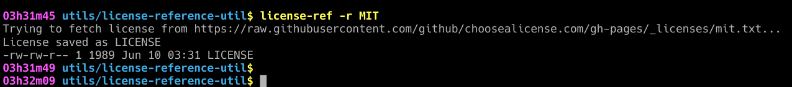

# *license-ref:* OSS License comparison table and downloader

Need a LICENSE for your OSS project?
 - Examine your options
 - Type one command to grab it.

*`license-ref` maintains the URL lists, including backup/alternative locations.*

## Plans:

*I'd like to separate the license options data, and provide other versions. Pull-requests are welcome.* I'm thinking we add Python, PowerShell, Go, maybe plain sh?

```bash
$ license-ref
View license options and comparison
```

<div align="center">
  <em>Main Listing...</em><br>
  <br>
</div>

```bash
$ license-ref -r MIT
Download the MIT license as LICENSE in the current folder
```

<div align="center">
  <em>Downloading a License...</em><br>
  <br>
</div>

